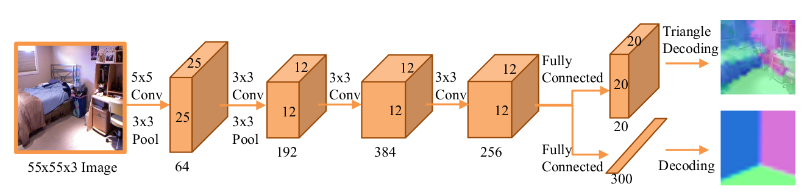
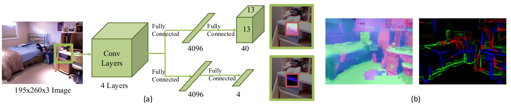
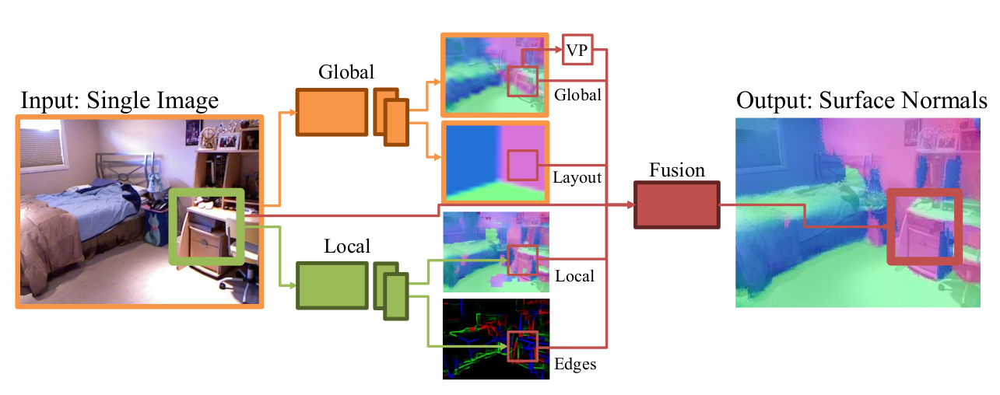

# Designing Deep Networks for Surface Normal Estimation

CVPR2015

## Introduction

This paper uses CNN to estimate surface normals.

## Method

The CNN combines a global network and a local network

The global network is used to get the global information and give a coarse output. At 4th Conv layers, the output is feed to 2 seperate FC layers. One to predict normals, and the other to predict the room layout.

The normal is usually continuous a value. But here they uses triangle coding to make it categorical. The they uses 20 categories. The room layout is also a categorical value learned from clustering. Loss used is cross-entropy loss.

The local network is used to refine the local details. The Conv layer has the same structure as the global network. And the two seperate fully connected outputs are normals in 40 categories and edges with four categories: convex, concave, occlusion and no edge.

Given an image with size 195 x 260, perform sliding window on it with a window of size 55 x 55 and stride of 13 (defined to match the output size). Normals of 13 x 13 pixels in the center of the window is predicted, which gains information in the context. 

Finally, combine original image and the outputs from global and local network, which are resized or upsampled to the size of the original image, and feed them to the fusion network. The fusion network has the similar structure as the local network. 

