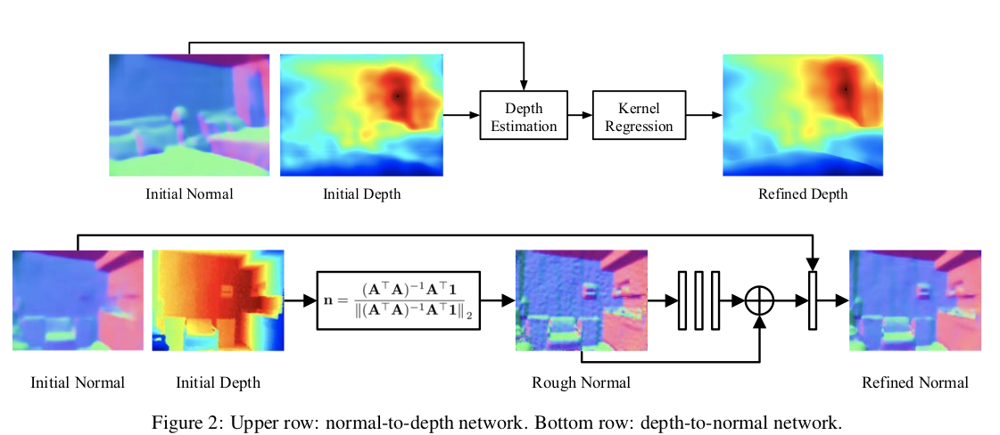

# GeoNet: Geometric Neural Network for Joint Depth and Surface Normal Estimation

CVPR 2018

## Summary

This paper presents GeoNet, a novel network architecture which incoorporate depth and surface normal to refine the prediction. 

## Method

First, two stream CNNs are used to predict initial depth and normal. 

Then, with the initial prediction of depth and normal, they used two networks to refine the prediction, normal-to-depth network and depth-to-normal network respectively.

The normal-to-depth network has no weights. We can estimate the depth of pixel i from a neighbor pixel j, by using the normal and coordinates of i and j. Then we apply kernel regression to aggregate the estimations from all neighbor pixels to get the refined depth. The kernel used here is a linear kernel, which is the inner product of the normals of i and j. It can be viewed as a voting process where every pixel in the neighborhood of i gives a “vote” to determine the depth of pixel i.

The depth-to-normal network uses a Least Square Model to estimate the normal from the depth by minimizing ||An − b||^2, where A(Kx3) is the pixels in the tangent plane, n is the normal, b is a constant. The reason is normal n of the tangent plane satisfy An = b. The solution of the Least Squared Model is as shown in the figure above. The normal estimated by this is sometimes noise and is rough as shown above. So we apply a residule module with 3 conv layers with skip-connection and before applying 1x1 convolution, the output of the conv layers are concatenated with the initial normal estimation.

The lost function is the squared distance between initial estimation and GT plus the distance between refined estimation and GT. This applies to both depth estimation and surface normal estimation.
