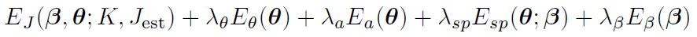

# Keep it SMPL: Automatic Estimation of 3D Human Pose and Shape from a Single Image

ECCV 2016

## Introduction

The estimation of 3D human pose from a single image is a longstanding problem with many applications. But many of them requires prior knowledge or manual intervention. For example some methods which transform 2D pose to 3D pose assume a fixed ratio of limb-lengths. There are also works which predict 3D pose and shape from image, which often require silhouettes. This paper does automatic estimation of both 3D pose and shape from a single image without manual intervention.

## Method

The paper uses a too staged aproached. First predict 2D pose from a single image using DeepCut. Then fit SMPL to get 3D pose and shape from 2D pose alone.(as apposed to some method which coorperate predicted 2D pose and original image feature, this method does not have any information other than 2D pose in the second stage)

SMPL(Skinned Multi-person Linear Model) is a parametric learned human body model which takes as parameter shape vector β and pose vector θ. This model is trained on large human body scan dataset and thus is a good statistical human body model. 

SMPL formulation: 

Fit SMPL by minimizing the objective function:

The Error terms are as follows:

- Joint distance penalty
- Unnature bend penalty
- Unlikely Pose penalty
- Interpenetration penalty
- Regularization of β