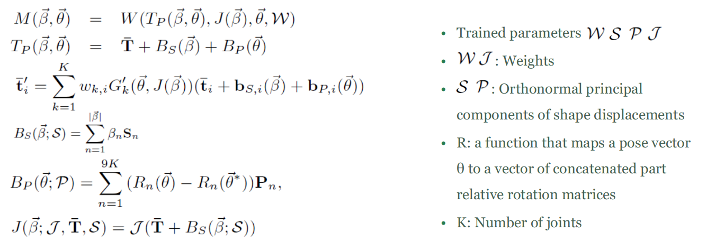

# SMPL: A Skinned Multi-Person Linear Model

CVPR2015

# Introduction

SMPL is a parametric learned human body model which takes as parameter shape vector β and pose vector θ and gives realistic animated human bodies that can represent different body shapes, deform naturally with pose, and exhibit soft-tissue motions like those of real humans. This model is trained on large human body scan dataset and thus is a good statistical human body model. 

# Model Formulation

