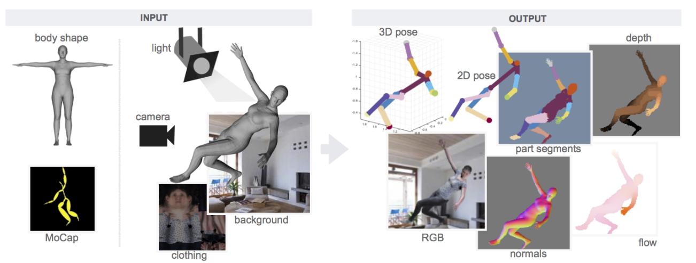

# Learning from Synthetic Humans

CVPR2017

# Introduction

manual labeling of 3D pose, depth and motion is impractical. This paper presents SURREAL (Synthetic hUmans foR REAL tasks): a new large-scale dataset with synthetically-generated but realistic images of people rendered from 3D sequences of human motion capture data.

# Method

- Body model: SMPL
- Shape: fit SMPL to CAESAR dataset
- Pose: fit SMPL to CMU MoCap dataset
- Texture(clothing): CAESAR scans and 3D scans of subjects with normal clothing
- Light: Spherical Harmonics with 9 coefficients
- Background: render the person on top of a static background image sampled from LSUN dataset
