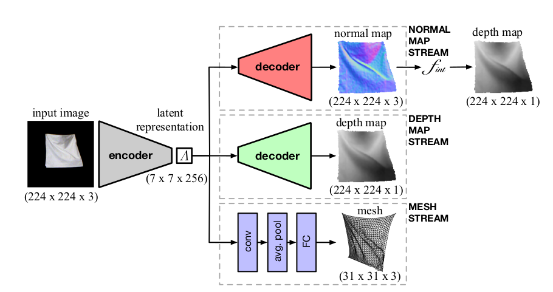

# Learning to Reconstruct Texture-less Deformable Surfaces from a Single View

2018

## Summary

This paper presents a data-driven method to recover the shape of complex and deforming texture-less surfaces from a single image. They collected a dataset or clothes and papers in defferent shape and lighting and used that to train a network.

## Method

Network:

- Based on SegNet but with multiple output branches.
- Loss function: MSE for vertex mesh, cosine similarity favoring unit length vector for normal map, abosolute difference for depth map.